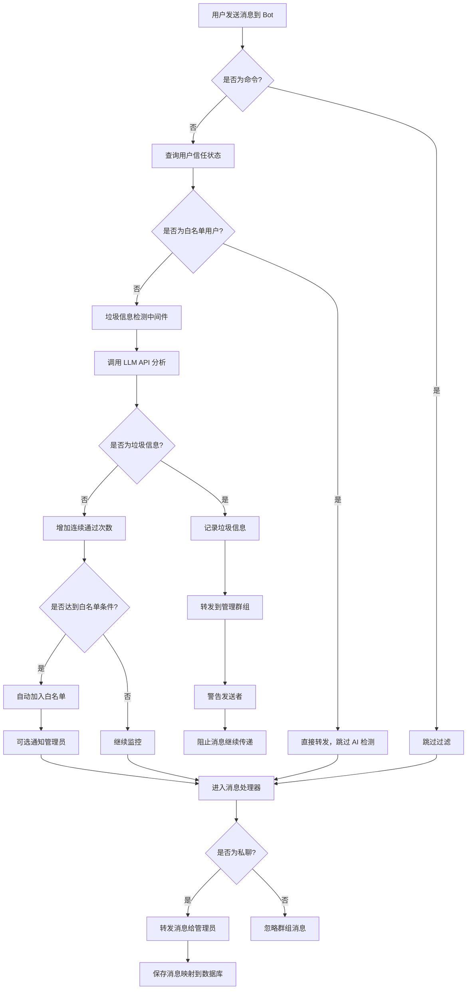
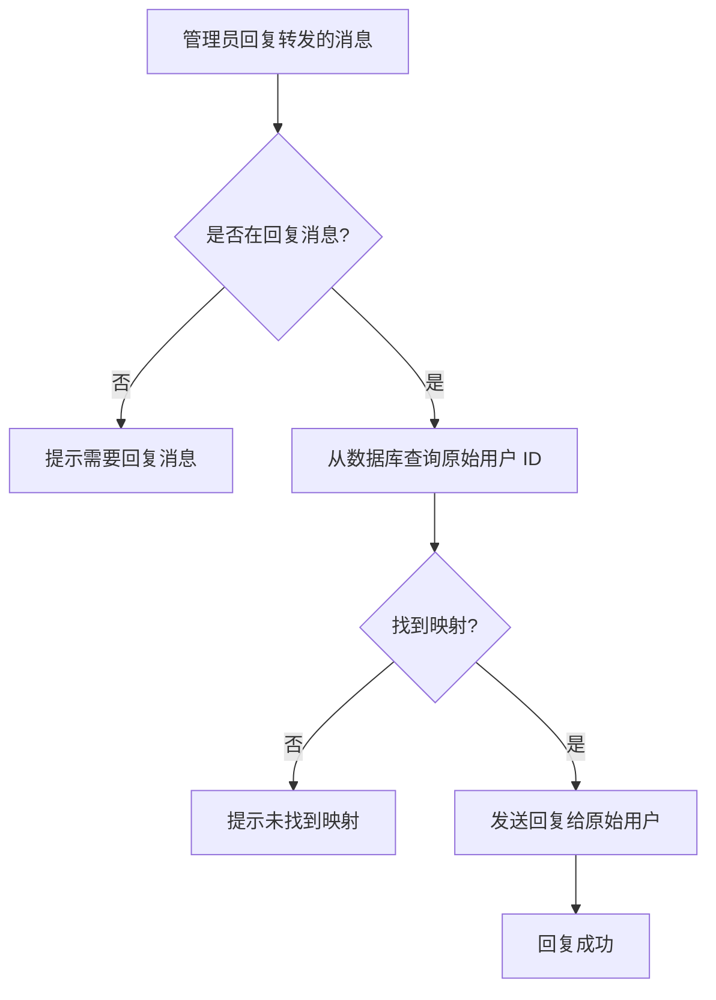

# Telegram Watchdog

一个智能 Telegram Bot，提供 AI 驱动的垃圾信息过滤和管理员消息转发功能。**支持 Cloudflare Workers 和 Docker 自托管两种部署方式**，可按需选择。

## 📋 项目介绍

Telegram Watchdog 是一个功能强大的 Telegram 机器人，主要用于：

1. **AI 垃圾信息检测**：使用 LLM（大语言模型）自动识别和过滤垃圾信息、广告、诈骗等不良内容
2. **智能白名单系统**：自动识别可信用户，减少 AI 检测成本并提升用户体验
3. **管理员消息中继**：自动将用户私聊消息转发给管理员，并支持管理员回复功能
4. **实时监控**：检测到垃圾信息时自动转发到管理群组，提供详细的分析报告

### 主要特性

- 🤖 **AI 智能过滤**：基于 LLM 的智能垃圾信息识别
- ✅ **自动白名单**：用户连续通过 3 次检测后自动加入白名单，跳过后续 AI 检测
- 👮 **管理员命令**：支持 `/trust`、`/untrust` 和 `/getid` 命令
- 💬 **双向消息转发**：用户消息转发给管理员，管理员可直接回复
- 🧵 **Forum Topic 管理**：自动为每个用户创建独立 Topic，垃圾消息集中到 Spam Topic
- 🗄️ **持久化存储**：D1 或 SQLite 文件，存储消息映射和用户信任度
- 🚢 **双部署支持**：Cloudflare Workers（边缘 / 零运维）或 Docker（自托管 / 数据自控）
- 🔒 **安全验证**：Webhook 请求使用密钥验证，确保安全性

## 🛠️ 技术栈

- **[Hono](https://hono.dev/)** - 轻量级 Web 框架，可同时跑在 Workers 与 Node
- **[Grammy](https://grammy.dev/)** - 现代化的 Telegram Bot 框架
- **[OpenAI SDK](https://github.com/openai/openai-node)** - 用于调用 LLM API 进行垃圾信息检测
- **[TypeScript](https://www.typescriptlang.org/)** - 类型安全的开发语言

按部署方式不同，运行时分别用：

| 维度 | Cloudflare Workers | Docker / Node |
|------|-------------------|---------------|
| 运行时 | [Cloudflare Workers](https://workers.cloudflare.com/) | Node.js **24+** |
| 数据库 | [Cloudflare D1](https://developers.cloudflare.com/d1/) | `node:sqlite`（内置）+ 文件 Volume |
| 入口 | [src/index.ts](src/index.ts) | [src/server.ts](src/server.ts) |
| 构建 / 发布 | [Wrangler](https://developers.cloudflare.com/workers/wrangler/) | Dockerfile（基于 `node:24-bookworm-slim`） |

业务代码完全共享，差异收敛在数据库适配层和入口文件。

## 📦 所需外部组件

无论哪种部署方式，都需要以下基础组件：

1. **Telegram Bot Token** — 通过 [@BotFather](https://t.me/botfather) 创建
2. **管理员 Telegram 账户** — 用于接收转发消息
3. **管理群组**（推荐启用 Forum 模式）— 用于接收垃圾警报和按用户分 Topic
4. **LLM API 服务** — OpenAI 或兼容 API（提供 Base URL 和 API Key）

部署方式特定要求：

- **Cloudflare Workers**：Cloudflare 账户（含 Workers 与 D1，免费额度即可起步）+ 一个域名（Workers 默认子域也行）
- **Docker**：一台 Docker 主机 + 一个公网 HTTPS 域名（用反代终止 TLS）

---

## 🚀 部署指南

本项目提供两种部署方式，二选一即可：

| 方式 | 适合场景 | 数据库 | 入口 |
|------|---------|-------|------|
| **A. Cloudflare Workers** | 零运维、全球边缘、免费额度充足 | D1 | [src/index.ts](src/index.ts) |
| **B. Docker 自托管** | 私有环境、需要数据完全自管 | `node:sqlite` + Volume | [src/server.ts](src/server.ts) |

### 通用前置步骤（两种方式都要做）

#### 1. 创建 Telegram Bot

1. 在 Telegram 中找到 [@BotFather](https://t.me/botfather)
2. 发送 `/newbot` 命令创建新 Bot
3. 按提示设置 Bot 名称和用户名
4. 保存 BotFather 返回的 **Bot Token**（格式如：`123456:ABC-DEF1234ghIkl-zyx57W2v1u123ew11`）

#### 2. 获取 Telegram ID

1. **管理员用户 ID**：在 Telegram 中找到 [@userinfobot](https://t.me/userinfobot)，发送任意消息即可获得
2. **管理群组 ID**（可选，推荐启用 Forum Topic 功能）：
   - 创建一个超级群组
   - 在群组设置中启用 "Topics"（话题）功能
   - 将 Bot 添加到群组并设为管理员（需要 `can_manage_topics` 权限）
   - 在群组内发送 `/getid`，Bot 会返回群组 ID（负数，如：`-1001234567890`）

#### 3. 克隆代码

```bash
git clone <your-repo-url>
cd telegram-watchdog
```

### 环境变量清单

两种部署方式使用同一组环境变量：

| 变量名 | 必需 | 说明 | 示例 |
|--------|------|------|------|
| `DOMAIN` | ✅ | 公网域名（必须 HTTPS），webhook 指向 `${DOMAIN}/webhook` | `https://bot.example.com` |
| `BOT_TOKEN` | ✅ | Telegram Bot Token | `123456:ABC-DEF...` |
| `BOT_SECRET` | ✅ | Webhook 验证密钥（自己生成的随机字符串） | 任意随机字符串 |
| `ADMIN_UID` | ✅ | 管理员 Telegram 用户 ID | `123456789` |
| `ADMIN_GID` | ❌ | 管理群组 ID（启用后开启 Forum Topic 模式） | `-1001234567890` |
| `LLM_API` | ✅ | LLM API Base URL | `https://api.openai.com/v1` |
| `LLM_MODEL` | ✅ | LLM 模型名称 | `gpt-3.5-turbo` |
| `LLM_KEY` | ✅ | LLM API Key | `sk-...` |
| `PORT` | ❌（仅 Docker） | 容器监听端口，默认 `3000` | `3000` |
| `DB_PATH` | ❌（仅 Docker） | SQLite 文件路径，默认 `/data/watchdog.db` | `/data/watchdog.db` |

---

### 方式 A：Cloudflare Workers

#### A1. 安装依赖

```bash
npm install
```

#### A2. 创建 D1 数据库

1. 在 Cloudflare 控制面板中，导航至 **D1 SQL 数据库** 页面
2. 选择 **创建数据库**，命名为 `watchdog`
3. [wrangler.jsonc](wrangler.jsonc) 已配置好绑定（`binding: "DB"`）

#### A3. 部署

```bash
# 第一次运行会出现登录链接，浏览器打开后授权登录，再重新运行
npm run deploy
```

部署成功后会输出 Worker URL，例如 `https://telegram-watchdog.your-account.workers.dev`。

#### A4. 配置环境变量（在 Cloudflare 仪表板）

1. 进入 **Workers & Pages** → 选择你的 Worker → **设置** → **变量和机密**
2. 选择 **添加** → **密钥** 类型，逐个录入上面环境变量清单中的值（除 `PORT` / `DB_PATH` 外都需要）

---

### 方式 B：Docker 自托管

镜像由 GitHub Actions 自动构建并推送到 GHCR（基于 `node:24-bookworm-slim`，无原生模块编译）：

- **镜像地址**：`ghcr.io/pupilcc/telegram-watchdog:latest`
- **CI 配置**：[.github/workflows/release-docker-image.yml](.github/workflows/release-docker-image.yml) — `master` 分支推送和打 tag 时自动发布

#### B1. 准备部署文件和 `.env`

如果只是部署、不需要源码，跳过 `git clone`，直接拉取这两个文件即可：

```bash
mkdir telegram-watchdog && cd telegram-watchdog

# docker-compose.yml
curl -O https://raw.githubusercontent.com/pupilcc/telegram-watchdog/master/docker-compose.yml

# .env 模板
curl -o .env https://raw.githubusercontent.com/pupilcc/telegram-watchdog/master/.env.example
```

然后编辑 `.env`，填入 `DOMAIN` / `BOT_TOKEN` / `BOT_SECRET` / `ADMIN_UID` / `LLM_KEY` 等（参考上面的[环境变量清单](#环境变量清单)）。

#### B2. 准备公网 HTTPS 反代

Telegram 要求 webhook 必须 HTTPS。容器本身只监听 HTTP（默认 3000），**必须**在前面套一层反向代理（Caddy / Nginx / Traefik / Cloudflare Tunnel 等）来终止 TLS，并把 `DOMAIN` 指向该公网地址。

最简的 Caddy 配置示例：

```
watchdog.example.com {
    reverse_proxy localhost:3000
}
```

#### B3. 启动容器

**方式一：docker compose（推荐）**

仓库已附带 [docker-compose.yml](docker-compose.yml)，默认拉取 `ghcr.io/pupilcc/telegram-watchdog:latest`。把 `docker-compose.yml` 和 `.env` 放在同一目录后：

```bash
docker compose up -d
docker compose logs -f watchdog          # 查看日志，确认 setWebhook 成功

# 升级到最新镜像
docker compose pull && docker compose up -d
```

**方式二：docker run**

```bash
docker run -d --name telegram-watchdog \
  --env-file .env \
  -p 3000:3000 \
  -v telegram-watchdog-data:/data \
  --restart unless-stopped \
  ghcr.io/pupilcc/telegram-watchdog:latest
```

> 如果你 fork 了仓库或本地修改了源码，可以 `docker compose up -d --build`（同时取消 [docker-compose.yml](docker-compose.yml) 里 `build: .` 的注释）从源码构建镜像。

#### B4. 数据持久化

SQLite 文件位于容器内 `/data/watchdog.db`，对应 `docker-compose.yml` 的 `watchdog-data` 命名 volume。`docker compose down` **不会**删除该 volume；需显式 `docker volume rm telegram-watchdog_watchdog-data` 才会清空数据。

#### B5. 本地开发（不进容器）

```bash
nvm use 24                  # 或确保 node --version >= v24
npm install
cp .env.example .env        # DB_PATH 可改为本地路径如 ./watchdog.db
npm run dev:node            # tsx watch，文件改动自动重启
```

可用 `ngrok http 3000` 暴露本地端口拿到 HTTPS URL，把 `DOMAIN` 改为 ngrok 地址即可联调。

---

### 验证部署（两种方式通用）

1. **检查 Webhook 是否设置成功**：
   ```bash
   curl https://api.telegram.org/bot<BOT_TOKEN>/getWebhookInfo
   ```
   `url` 字段应为 `${DOMAIN}/webhook`

2. **健康检查**：访问 `https://${DOMAIN}/` 应返回 `Hello Hono!`

3. **测试 Bot 功能**：
   - 在 Telegram 中向 Bot 发送消息，检查管理员是否收到转发
   - 回复转发的消息，检查是否发送给原始用户

4. **测试垃圾信息检测**：发送明显的广告或垃圾信息，检查管理群组是否收到警报

---

## 📁 项目代码结构

```
telegram-watchdog/
├── src/
│   ├── index.ts              # Cloudflare Workers 入口（Hono + 懒初始化）
│   ├── server.ts             # Node / Docker 入口（@hono/node-server）
│   ├── app.ts                # 共享 bot 工厂（两种入口都调用）
│   ├── env.ts                # Env 类型定义
│   ├── config.ts             # 白名单系统配置常量
│   ├── bot/
│   │   ├── command.ts        # /start 等命令处理器
│   │   ├── commands.ts       # 管理员命令（/trust、/untrust、/getid）
│   │   ├── middleware.ts     # 垃圾信息过滤和白名单检查中间件
│   │   ├── message.ts        # 消息转发处理器
│   │   └── forum.ts          # Forum Topic 管理
│   ├── llm/
│   │   ├── client.ts         # LLM API 客户端和垃圾信息检测
│   │   └── prompt.ts         # LLM 提示词模板
│   └── db/
│       ├── client.ts         # 通用 DBClient 接口（D1 子集）
│       ├── sqlite-adapter.ts # node:sqlite 适配器（Docker 用）
│       ├── init.ts           # 数据库表结构初始化
│       ├── trust.ts          # 用户信任度数据库操作
│       └── topics.ts         # Forum Topic 数据库操作
├── Dockerfile                # Docker 镜像（Node 24，无原生编译）
├── docker-compose.yml        # 单服务编排，含数据 volume
├── .dockerignore
├── .env.example              # 环境变量样板
├── package.json
├── wrangler.jsonc            # Cloudflare Workers 配置
├── tsconfig.json
└── README.md
```

### 核心文件说明

- **src/index.ts**：Workers 入口；`c.env` 是请求作用域的，因此 bot 在第一次请求时懒初始化
- **src/server.ts**：Node 入口；启动时从 `process.env` 读配置、打开 SQLite、设置 webhook 并监听端口
- **src/app.ts**：共享的 `setupBot(env)` 工厂；两个入口都调用它装配命令、过滤中间件、消息处理器
- **src/db/client.ts**：业务代码统一面向的 `DBClient` 接口（D1 API 的最小子集）；`D1Database` 与 sqlite-adapter 都满足
- **src/db/sqlite-adapter.ts**：把 `node:sqlite` 的同步 `DatabaseSync` 包装成异步的 `DBClient`，使 db/* 中的查询代码与 D1 调用方式完全一致
- **src/bot/middleware.ts**：拦截所有消息，检查白名单状态并调用 LLM 进行垃圾信息检测
- **src/bot/commands.ts**：处理管理员命令（`/trust`、`/untrust`、`/getid`）
- **src/bot/message.ts**：处理用户与管理员之间的消息转发逻辑
- **src/bot/forum.ts**：Forum Topic 创建和管理，支持用户 Topic 名称自动更新
- **src/llm/client.ts**：封装 OpenAI SDK，提供统一的 LLM 调用接口
- **src/db/init.ts**：创建和维护数据库表结构

## 🔄 业务流程

### 1. 用户发送消息流程（含白名单检查）



### 2. 管理员回复流程



### 3. 垃圾信息检测流程

```
用户消息 → 提取发送者姓名和消息内容
         ↓
    填充提示词模板
         ↓
    调用 LLM API 判断
         ↓
    解析返回结果
         ↓
    ┌─────────────┬─────────────┐
    │   SPAM:原因  │    CLEAN    │
    ↓             ↓
  垃圾信息      正常消息
```

## ✅ 白名单系统

### 工作原理

白名单系统通过追踪用户的历史行为，自动识别可信用户并跳过 AI 检测，从而降低 API 成本并提升用户体验。

### 用户信任等级

系统为每个用户维护以下状态：

- **`new`（新用户）**：首次发送消息或曾被标记为垃圾的用户，每条消息都需要 AI 检测
- **`trusted`（白名单用户）**：已通过验证的可信用户，消息直接转发，完全跳过 AI 检测
- **`monitoring`（监控中）**：曾被标记为垃圾但正在重新积累信任的用户

### 自动加入白名单

用户满足以下条件后会自动加入白名单：

1. **连续通过 3 次** AI 垃圾信息检测
2. **从未被标记**为垃圾信息（`total_spam_count = 0`）

加入白名单后：
- 用户的所有后续消息直接转发，不再消耗 AI API 配额
- 可选择通知管理员（可在 `src/config.ts` 中配置）

### 管理员命令

管理员可以通过以下命令手动管理用户信任度：

#### `/trust` - 立即加入白名单

**使用方法：**
1. 在转发的用户消息下回复
2. 输入 `/trust`
3. 该用户立即加入白名单，无需等待自动验证

**示例：**
```
[转发的用户消息]
    ↓ 回复
/trust
    ↓ Bot 响应
✅ 用户已手动加入白名单
```

#### `/untrust` - 移除白名单

**使用方法：**
1. 在转发的用户消息下回复
2. 输入 `/untrust`
3. 该用户被移出白名单，重新进入监控状态

**效果：**
- 用户的 `trust_status` 变为 `new`
- `consecutive_clean_count` 重置为 0
- `total_spam_count` 增加 1（防止短期内再次自动加白）
- 后续消息需重新通过 AI 检测

**示例：**
```
[转发的用户消息]
    ↓ 回复
/untrust
    ↓ Bot 响应
⚠️ 用户已移除白名单，重新进入监控
```

#### `/getid` - 获取 ID 信息

**使用方法：**
在任意聊天中发送 `/getid`

**返回信息：**
- 你的用户 ID
- 当前聊天 ID
- 聊天类型
- Topic ID（如果在 Forum Topic 内）

**示例：**
```
/getid
    ↓ Bot 响应
📋 ID 信息

👤 你的用户 ID: `123456789`
💬 当前聊天 ID: `-1001234567890`
📝 聊天类型: supergroup
🧵 Topic ID: `123`
```

### 白名单配置

可以在 `src/config.ts` 中调整白名单系统的行为：

```typescript
export const WHITELIST_CONFIG = {
  // 自动加白所需的连续通过次数（默认 3）
  REQUIRED_CLEAN_COUNT: 3,

  // 允许的垃圾消息次数（默认 0 = 从未被标记）
  MAX_ALLOWED_SPAM_COUNT: 0,

  // 自动加白时是否通知管理员（默认 true）
  NOTIFY_ADMIN_ON_AUTO_WHITELIST: true,
};
```

### 数据库表结构

白名单系统使用 `user_trust` 表存储用户信任度信息：

| 字段 | 类型 | 说明 |
|------|------|------|
| `user_id` | TEXT | Telegram 用户 ID（主键） |
| `username` | TEXT | 用户名（可选） |
| `trust_status` | TEXT | 信任状态（`new`/`trusted`/`monitoring`） |
| `consecutive_clean_count` | INTEGER | 连续通过 AI 检测的次数 |
| `total_spam_count` | INTEGER | 累计垃圾消息次数 |
| `whitelisted_at` | INTEGER | 加入白名单的时间戳 |
| `whitelisted_by` | TEXT | 加白来源（`auto`/`admin`） |
| `last_message_at` | INTEGER | 最后一条消息的时间戳 |
| `created_at` | INTEGER | 记录创建时间 |

### 使用场景示例

#### 场景 1：新用户自动晋升

```
1. 用户第一次发消息 → AI 检测通过 ✅
   状态：consecutive_clean_count = 1

2. 用户第二次发消息 → AI 检测通过 ✅
   状态：consecutive_clean_count = 2

3. 用户第三次发消息 → AI 检测通过 ✅
   状态：自动升级为 trusted
   管理员收到通知："✅ 用户 xxx 已自动加入白名单"

4. 用户第四次发消息 → 直接转发 🚀
   不再调用 AI API
```

#### 场景 2：垃圾消息打断进度

```
1. 用户发送 2 条正常消息 → consecutive_clean_count = 2

2. 用户发送垃圾消息 → AI 检测为 SPAM ⚠️
   状态：consecutive_clean_count = 0（重置）
          total_spam_count = 1
          trust_status = monitoring

3. 用户重新发送正常消息 → 从 1 开始重新计数
   需要再连续通过 3 次才能加白
```

#### 场景 3：管理员手动管理

```
1. 用户发送第一条消息

2. 管理员认为用户可信，回复 /trust
   → 用户立即加入白名单，无需等待

3. 后续消息直接转发

4. 管理员发现用户发送问题内容，回复 /untrust
   → 用户被移出白名单

5. 用户下次发消息 → 重新进入 AI 检测
```

## 🧵 Forum Topic 功能

### 功能概述

当配置了 `ADMIN_GID`（管理群组）且该群组启用了 Forum 功能时，Bot 会自动使用 Topic 来组织消息：

- **Spam Topic**：所有垃圾消息集中在 `🚨 Spam` Topic 中
- **用户 Topic**：每个用户拥有独立的 `👤 用户名` Topic

### 前置要求

1. **创建 Forum 群组**：
   - 创建一个超级群组
   - 在群组设置中启用 "Topics"（话题）功能

2. **Bot 权限**：
   - 将 Bot 添加为群组管理员
   - 确保 Bot 拥有 `can_manage_topics` 权限

### 工作流程

#### 垃圾消息处理
```
用户发送垃圾消息
    ↓
AI 检测为 SPAM
    ↓
检查/创建 "🚨 Spam" Topic
    ↓
将消息转发到 Spam Topic
    ↓
发送警告信息到同一 Topic
```

#### 正常消息处理
```
用户发送正常消息
    ↓
检查用户是否已有 Topic
    ↓
├─ 无 → 创建 "👤 用户名" Topic
└─ 有 → 检查用户名是否变更，自动更新 Topic 名称
    ↓
将消息转发到用户的 Topic
```

#### 管理员回复
```
管理员在用户 Topic 内发送消息
    ↓
Bot 自动识别 Topic 对应的用户
    ↓
将消息发送给该用户
```

### 特性

- **直接发消息**：在用户 Topic 内直接打字即可发送给用户，无需回复特定消息
- **用户名自动更新**：当用户修改昵称后，Topic 名称会自动同步更新
- **回退机制**：如果 Topic 创建失败（权限不足等），自动回退到普通消息发送

### 数据库表

#### `forum_topics` - 系统 Topic 存储

| 字段 | 类型 | 说明 |
|------|------|------|
| `topic_type` | TEXT | Topic 类型（如 `spam`）（主键） |
| `topic_id` | INTEGER | Telegram Topic ID |
| `created_at` | INTEGER | 创建时间戳 |

#### `user_topics` - 用户 Topic 映射

| 字段 | 类型 | 说明 |
|------|------|------|
| `user_id` | TEXT | 用户 Telegram ID（主键） |
| `topic_id` | INTEGER | 用户专属 Topic ID |
| `topic_name` | TEXT | Topic 名称 |
| `created_at` | INTEGER | 创建时间戳 |

## 🐛 故障排查

### Bot 无响应

1. 检查 Webhook 设置：访问 `https://api.telegram.org/bot<TOKEN>/getWebhookInfo`
2. 查看运行日志：
   - Cloudflare：`wrangler tail`
   - Docker：`docker compose logs -f watchdog`
3. 确认环境变量配置正确

### 垃圾信息检测不工作

1. 检查 LLM API 配置（URL、Key、Model）
2. 查看日志确认 API 调用是否成功
3. 测试 API 是否可访问：`curl -H "Authorization: Bearer $LLM_KEY" $LLM_API/models`

### 管理员回复失败

1. 确认消息映射已保存到数据库（D1 控制台 / 容器内 `/data/watchdog.db`）
2. 确认管理员在回复转发的消息，而不是直接发送新消息
3. 检查原始用户是否屏蔽了 Bot

### Docker 启动报 `node:sqlite` 错误

1. 确认基础镜像是 `node:24-*`（Node 22 上 `node:sqlite` 仍是 experimental，需要 `--experimental-sqlite` flag）
2. 本地开发用 `node --version` 检查是否 ≥ v24
